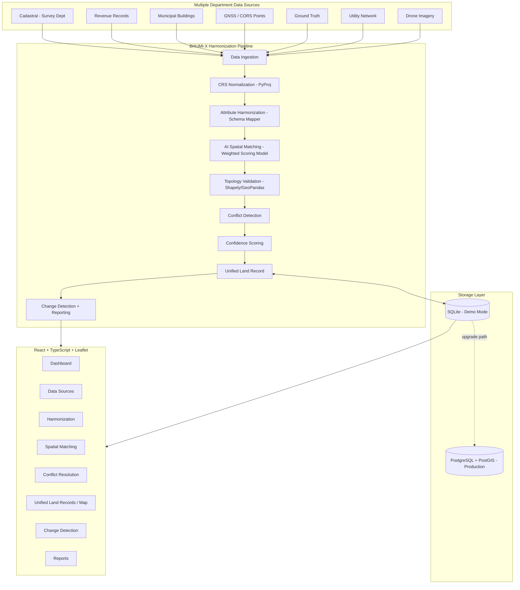

# BHUMI-X Architecture

## System Diagram

```mermaid
flowchart TD
    subgraph Sources["Multiple Department Data Sources"]
        A1[Cadastral - Survey Dept]
        A2[Revenue Records]
        A3[Municipal Buildings]
        A4[GNSS / CORS Points]
        A5[Ground Truth]
        A6[Utility Network]
        A7[Drone Imagery]
    end

    subgraph Pipeline["BHUMI-X Harmonization Pipeline"]
        B1[Data Ingestion]
        B2[CRS Normalization - PyProj]
        B3[Attribute Harmonization - Schema Mapper]
        B4[AI Spatial Matching - Weighted Scoring Model]
        B5[Topology Validation - Shapely/GeoPandas]
        B6[Conflict Detection]
        B7[Confidence Scoring]
        B8[Unified Land Record]
        B9[Change Detection + Reporting]
    end

    subgraph Storage["Storage Layer"]
        D1[(SQLite - Demo Mode)]
        D2[(PostgreSQL + PostGIS - Production)]
    end

    subgraph Frontend["React + TypeScript + Leaflet"]
        F1[Dashboard]
        F2[Data Sources]
        F3[Harmonization]
        F4[Spatial Matching]
        F5[Conflict Resolution]
        F6[Unified Land Records / Map]
        F7[Change Detection]
        F8[Reports]
    end

    A1 & A2 & A3 & A4 & A5 & A6 & A7 --> B1
    B1 --> B2 --> B3 --> B4 --> B5 --> B6 --> B7 --> B8 --> B9
    B8 <--> D1
    D1 -.upgrade path.-> D2
    B9 --> Frontend
    D1 --> Frontend
```

## AI Spatial Matching Score Model